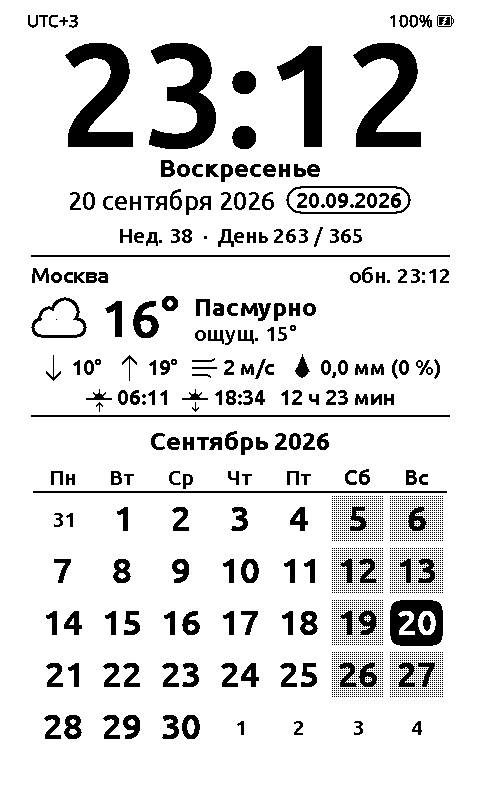
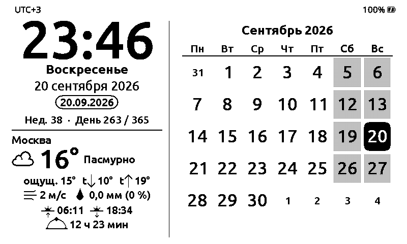
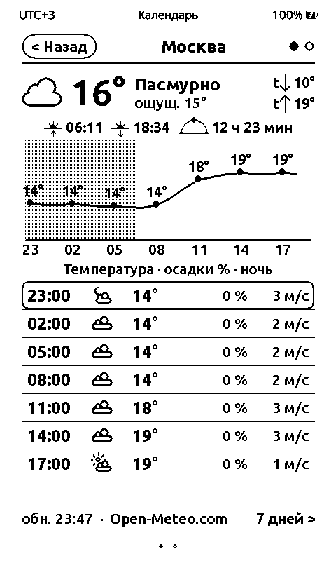
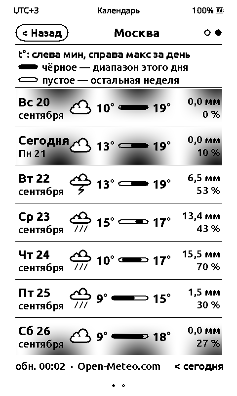
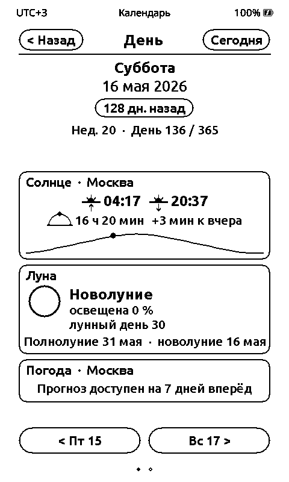
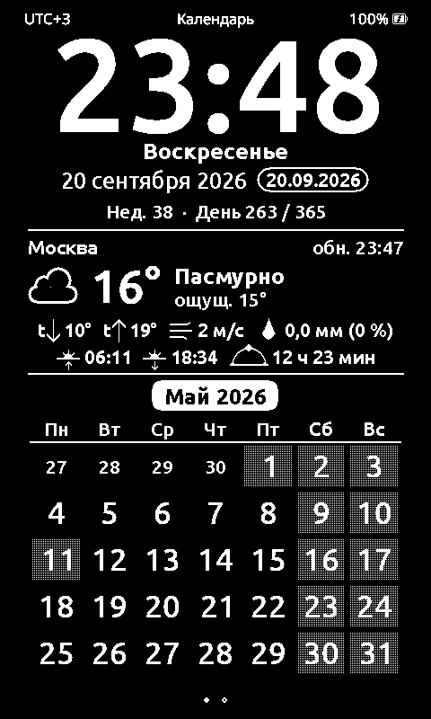
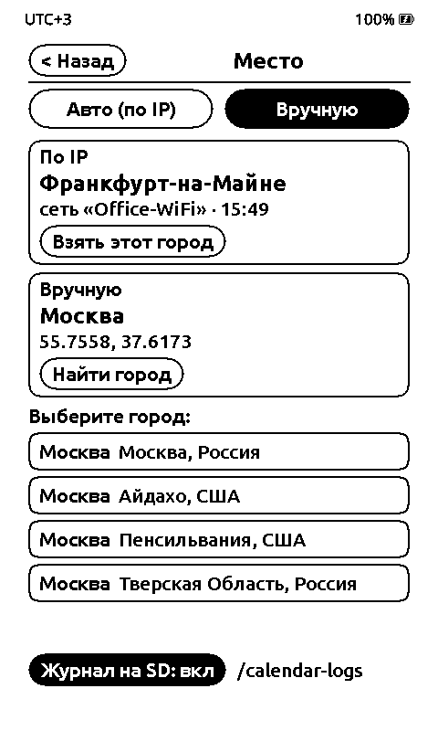

# CrossMux Calendar Face

Экран ожидания **«Календарь»** для читалки **M5Stack Paper Mono** на прошивке [CrossMux](https://github.com/0x1abin/crossmux).
Заменяет китайский календарь (老黄历) обычным: крупное время, дата, погода и сетка месяца. Работает в портрете и в ландшафте.

| Главный, портрет | Главный, ландшафт |
|---|---|
|  |  |

| Погода: сегодня | Погода: 7 дней | День | Год | Место |
|---|---|---|---|---|
|  |  |  |  |  |

*(Скриншоты из симулятора; погода Москвы — тестовая. Календарь праздников — настоящий.)*

## Что показывает

- **Время** `ЧЧ:ММ` крупно и **часовой пояс** (`UTC+3`) слева вверху; справа вверху — **заряд батареи с процентами** (показывается всегда, в том числе в полноэкранном режиме).
- **День недели**, дата двумя способами (`20 сентября 2026` и `20.09.2026`), номер ISO-недели и день года.
- **Погода** (Open-Meteo; если он недоступен из вашей сети — MET Norway): иконка, температура, описание, «ощущается», мин/макс за день («t↓ / t↑»), ветер и осадки — **значками, а не словами**, чтобы читалось издалека; время обновления. Город определяется **по IP**.
- **Восход, закат, длина дня** — считаются на устройстве по координатам города, без сети.
- **Сетка месяца** с понедельника: сегодня — чёрная плашка, **выходные, праздники и перенесённые выходные** — растр, дни соседних месяцев — мелко.
- **Тап по блоку погоды, по числу и по названию месяца** открывает подробные экраны (ниже).
- Языки надписей: русский, английский, немецкий (по языку интерфейса; для остальных — английский).

## Экраны по тапу

| Куда тапнуть | Что откроется |
|---|---|
| **Блок погоды** | «Погода»: страница 1 — ближайшие 24 часа (график температуры и осадков, ночь затенена, таблица каждые 3 часа, **восход и закат**); страница 2 — 7 дней. Между страницами — свайп ←/→ или кнопки Left/Right |
| **Число в сетке** | «День»: день недели, дата, «завтра / через N дн. / N дн. назад» (всегда отдельной строкой под датой), неделя и день года, **название праздника или переноса**, солнце (восход, закат, длина дня, разница со вчера, кривая за год), луна (фаза, освещённость, ближайшие полнолуние и новолуние), погода этого дня (если в пределах 7 дней). Свайп ←/→ — ±1 день, ↑/↓ — ±1 неделя |
| **Название месяца** | «Год»: полугодие крупно (6 месяцев), выходные и праздники подсвечены. Свайп ←/→ — полугодия, ↑/↓ — годы. Тап по месяцу возвращает на главный экран на этом месяце |
| **Название города** в шапке «Погоды» | «Место»: откуда брать город — **автоматически по IP или вручную**, поиск города по названию (подробнее ниже) |
| Любое другое место | Инверсия — как раньше |

Внутри этих экранов: **Back или «< Назад» закрывает** сначала экран (а не выходит на главную CrossMux); через 60 секунд без ввода экран закрывается сам; Confirm на «Погоде» — обновить сейчас, на «Дне» и «Годе» — вернуться к сегодня. Смена граней свайпом отключена, пока экран открыт.

Тап по зоне открывает экран и из полноэкранного режима (Immersive) сразу; тап мимо зон, как и раньше, сначала «будит» экран.

## Управление на устройстве

| Действие | Что делает |
|---|---|
| Кнопки Up / Down (или свайп ↑ / ↓) | Листать месяцы. Через 60 с без ввода — возврат к текущему; пока листаете, название месяца — на чёрной плашке |
| Кнопки Left / Right (или свайп ← / →) | Переключить грань: Календарь ⇄ Sloppy Clock |
| Тап по экрану / Confirm | Инверсия (чёрный фон) |
| Плитка «Ориентация» в шторке | Портрет / ландшафт (4 режима). Календарь подхватывает смену сразу |
| Back | Выход на главную |

Календарь открывается **первой** гранью. Через 5 секунд без ввода экран переходит в полноэкранный режим (без заголовка и точек-пейджера; время, пояс и батарея остаются).

**Часовой пояс** берётся из настроек часов CrossMux: *Настройки → Система → Смещение по UTC*. От него зависят и время на экране, и время восхода/заката. Формат 12/24 ч календарь не учитывает — время всегда 24-часовое.

## Праздники и переносы выходных

- Источник — производственный календарь [isdayoff.ru](https://isdayoff.ru) (без ключа): по одному запросу на **год** приходит строка «рабочий / нерабочий / сокращённый» на каждый день с учётом переносов. Страна задаётся в `CalendarConfig.h` (`kHolidayCountry`, по умолчанию `ru`).
- Календарь **загружается при выходе в сеть на `kHolidayPrefetchYears` лет вперёд** (по умолчанию 5) и **сохраняется на SD** (`/.crosspoint/calendar_holidays.json`). Год, которого нет в кэше, запрашивается **по требованию** — когда вы его открываете (месяц, «День», «Год»). Сохранённые прошлые годы не перезапрашиваются; текущий и будущие перепроверяются раз в `kHolidayRefreshDays` (30) дней — переносы иногда меняют постановлением.
- ⚠ Сервис отвечает **нулями, а не ошибкой**, для лет, которых ещё нет (правительство публикует календарь на следующий год осенью) и для лет до ~2004. Такой год считается «не опубликован» и перепроверяется позже.
- **Нет данных** (нет сети, год не опубликован) — подсвечиваются выходные и **фиксированные праздники** (для России: 1–8 января, 23 февраля, 8 марта, 1 и 9 мая, 12 июня, 4 ноября); переносы в этом случае неизвестны. Для других стран фиксированных праздников нет — только выходные.
- Подсветка праздников — та же, что у выходных. На экране «День» название праздника («День Победы»), «Перенос выходного дня», «Рабочий день (перенос)» или «Сокращённый рабочий день» пишется под датой; строка зарезервирована, поэтому содержимое не «прыгает». Отключить всё это: `kHolidaysEnabled = false`.

## Wi-Fi с логином и паролем (WPA2/WPA3-Enterprise)

Штатный CrossMux умеет вводить только пароль. Корпоративные сети, где при подключении просят **логин и пароль** (PEAP/MSCHAPv2 — самый частый вариант), с этой сборкой работают:

1. Откройте любой экран, который подключается к сети (например, «Передача файлов → Подключиться к сети»). Сети Enterprise распознаются по скану автоматически.
2. Выберите такую сеть — сначала спросят **логин** (заголовок клавиатуры «Wi-Fi login»), затем **пароль**.
3. После удачного подключения предлагается сохранить — логин и пароль запоминаются вместе (на SD, обфусцированно, как и обычные пароли) и дальше используются автоматически: календарь, синхронизация времени, AirPage и остальные экраны подключаются сами.

Ограничения (честно):
- **Скрытая сеть** («Добавить скрытую сеть…») Enterprise не распознаётся — у неё нет записи в скане. Обычная видимая корпоративная сеть работает.
- **Сертификат сервера не проверяется** (нет сертификата CA): подключение возможно к «двойнику» сети. Для e-reader это обычный компромисс, но помните об этом.
- **Проверено только на симуляторе и на сборке**: с настоящей корпоративной точкой доступа не пробовалось. Если не подключается — в `CalendarConfig.h` (раздел «Wi-Fi Enterprise») можно сменить метод (`kWifiEapMethod`: 0 — PEAP, 1 — TTLS) и задать внешнюю «анонимную» идентичность `kWifiEapAnonymousIdentity` (например, `anonymous@company.ru`), которую требуют некоторые сети. Логи — `pio device monitor`.
- Логин и пароль — до 64 байт каждый (ограничение клавиатуры и ESP-IDF).
- **Цена:** поддержка Enterprise добавляет к образу ≈ 95 КБ (прошивка 6 091 902 Б из 6 553 600 Б раздела, 93 %).

Как это устроено: логин и пароль лежат одной строкой в обычном поле пароля хранилища (`"\x1F" + логин + "\x1F" + пароль`), а все вызовы `WiFi.begin` заменены хуком на `calmod_wifi::begin` (`overlay/src/CalmodWifi.*`). Подробности — [CONCEPT.md §5.1 и §13.5](CONCEPT.md).

## Место: автоматически или вручную

Город для погоды и восхода/заката берётся **по IP** (автоматически) или **задаётся вручную**. По IP бывает неточно: в офисе с корпоративной сетью адрес часто «уводит» в другой город или другую страну.

Экран «Место» открывается **тапом по названию города** в шапке экрана «Погода» (а «Погода» — тапом по блоку погоды на главном):

- **«Авто (по IP)» / «Вручную»** — переключатель режима. Выбор хранится на SD-карте (`/.crosspoint/calendar_settings.json`) и переживает перезагрузку. Кнопками: ← — авто, → — вручную.
- **«По IP»** — что сейчас говорит сервис геолокации и через какую Wi-Fi-сеть это определено. В режиме «Авто» город перепроверяется раз в 3 часа **и сразу при смене Wi-Fi-сети** (пришли с работы домой — место обновится при первом же выходе в сеть). Кнопка **«Взять этот город»** — сделать его ручным.
- **«Вручную»** — выбранный город и его координаты. **«Найти город»** (или Confirm) открывает клавиатуру: введите название (можно по-русски — заголовок клавиатуры латиницей «City», так устроен шрифт прошивки) — город ищется в сети ([Open-Meteo Geocoding](https://open-meteo.com/en/docs/geocoding-api); не ответил или не нашёл — [OpenStreetMap Nominatim](https://nominatim.org/)), ниже появится до 5 вариантов с регионом и страной, тап — выбрать. Один вариант выбирается сразу. Можно ввести и **координаты**: `55.75, 37.62` (или `55,75 37,62`).
- В режиме «Вручную» перед названием города на главном экране и на «Погоде» стоит **метка** 📍, по IP место не запрашивается вообще.
- После смены места старая погода сразу скрывается («Нет данных») и загружается заново для нового места, как только будет сеть.

Начальный режим и город «по умолчанию» (до первого выбора) — в `CalendarConfig.h`: `kLocationAutoByDefault`, `kDefaultCity`/`kDefaultLatitude`/`kDefaultLongitude`.

## Журнал на SD-карте (диагностика)

Чтобы разобраться с проблемами, которые видны только на устройстве (Wi-Fi дома и на работе, погода не обновляется), календарь ведёт **подробный журнал** на SD-карте:

- Файлы: `/calendar-logs/ГГГГ-ММ-ДД.log` — по одному на день (обычный текст, видно на компьютере и через «Передачу файлов»).
- Что пишется: каждый выход в сеть — скан Wi-Fi (какие запомненные сети рядом и с каким сигналом), попытки подключения и **причины отключений** (коды Wi-Fi), ответы сервиса геолокации, результаты запросов погоды и календаря, время и объём; смены экранов и полные очистки экрана; раз в 10 минут — заряд, память, состояние Wi-Fi. Плюс **все сообщения самой прошивки** (строки с «~»), в том числе ошибки HTTP.
- Включается и выключается на экране «Место» (кнопка «Журнал на SD»). В этой сборке **включён по умолчанию** (`kSdLogByDefault`). На карту дописывается раз в 20 секунд и при выходе из календаря — несколько сотен килобайт в сутки.
- Каждый запрос расписан **по этапам** — адрес сервера (DNS), соединение (TCP), шифрование (TLS), ответ, объём, время каждого этапа, IP сервера. По такой строке сразу видно, где именно застряло: например, `ОШИБКА TCP: нет соединения с 94.130.142.35:443 за 10000 мс — сервер недоступен из этой сети` или `ОШИБКА TLS: TCP … есть, а шифрованное соединение не установилось`.
- Чтобы я разобрал журнал: скопируйте файлы с карты в папку `logs/` или `calendar-logs/` этого проекта (обе не попадают в git: в журнале есть имена ваших Wi-Fi-сетей и IP-адрес) и напишите, что и когда было не так.

## Как работает погода

- Раз в 15 минут (чаще нет смысла: «текущая погода» у Open-Meteo считается шагом 15 минут; и не раньше, чем через ~4 с после входа на экран) устройство включает Wi-Fi, коротким сканом (1–3 с) находит **самую сильную из запомненных сетей, которая сейчас в зоне видимости** (а не только ту, к которой подключались в прошлый раз — иначе, придя домой после работы, календарь продолжал бы биться в невидимую рабочую сеть), запрашивает данные и выключает Wi-Fi. Не подключилась — пробует следующую из видимых (до `kWifiMaxAttempts`); ни одной запомненной не видно — последнюю использованную «вслепую» (так работают скрытые сети). Сеть работает **в отдельной задаче**: даже если сервер «завис», экран и кнопки остаются живыми; каждый этап запроса (соединение, шифрование, ответ) ограничен `kHttpStageTimeoutSec` (10 с) — штатный клиент прошивки ждал бы до минуты. Плановый запрос не начинается, пока вы пользуетесь экраном: нужна пауза без ввода 3 секунды на главном экране и 10 секунд на вложенных (`kOnDemandDebounceMs`, `kDetailNetworkIdleSec`); запросы после подключения укладываются в `kNetworkBudgetSec` (30 с), подключение к одной сети — в `kWifiConnectTimeoutSec` (15 с; Enterprise — втрое дольше). При заряде ниже `kMinBatteryPctForNetwork` (10 %) плановые запросы пропускаются.
- Один запрос возвращает текущую погоду, **24 часа и 7 дней**, поэтому подробные экраны не требуют отдельного выхода в сеть и работают по кэшу. Ответы запрашиваются **сжатыми** (gzip) — по воздуху идёт в разы меньше.
- **Запасные пути к погоде.** Серверы берутся только по именам через DNS вашей сети, адреса в прошивке не зашиты. У Open-Meteo несколько серверов, и DNS выбирает их по региону; из части домашних и мобильных сетей тот сервер, что DNS отдаёт, недоступен вовсе (журнал 26.09.2026: дома нет даже TCP-соединения с `api.open-meteo.com`, при этом соседний сервер Open-Meteo — поиск города — отвечает за 0,4 с; старая прошивка ведёт себя так же). Поэтому, если Open-Meteo по HTTPS не ответил, календарь пробует **тот же сервер обычным HTTP** (если мешают только шифрованию; пропускается, когда сервер недоступен и по TCP), а затем **MET Norway** (`api.met.no`, Норвежский метеоинститут — другой сервер в другой сети; прогноз для всего мира). Сработавший путь запоминается и в следующий раз пробуется первым; запасной — не дольше часа (`kWeatherPrimaryRetryMin`), потом цепочка снова с Open-Meteo. У MET Norway нет вероятности осадков для России — вместо «%» показываются миллиметры за час; погода от него обновляется не чаще раза в 30 минут (`kMetNoMinRefreshMin`, так просит сервис). Источник подписан внизу экрана «Погода». Выключить запасные пути — `kWeatherHttpFallback`, `kWeatherMetNoFallback`.
- **Город** — по IP (`ipwhois.app`, название на языке интерфейса): не чаще раза в 3 часа, сразу при смене языка и **при смене Wi-Fi-сети**; или вручную — см. «Место» выше. Пока по IP ни разу не удалось, показывается **Москва** (задаётся в `CalendarConfig.h`).
- **Погода** — [Open-Meteo](https://open-meteo.com/) (без ключа, CC BY 4.0, бесплатно для некоммерческого использования); запасной источник — [MET Norway](https://api.met.no/) (без ключа, CC BY 4.0).
- **Запоминание.** Город и последняя погода лежат на SD-карте: `/.crosspoint/calendar_cache.json`. Нет сети — показываются они. Файл можно удалить: значения вернутся к умолчанию.
- **Заглушки.** Нет значения — `--`; нет данных совсем — перечёркнутое облако и «Нет данных»; данные старше 3 ч — пометка «устарело · ЧЧ:ММ»; старше 12 ч — значения не показываются, город остаётся.
- **Приватность.** Наружу уходит ваш IP (сервису геолокации; в режиме «Вручную» — нет), координаты города (Open-Meteo, при его недоступности — MET Norway; по запасному пути через обычный HTTP — открытым текстом, округлённые до ≈ 1 км) и, при поиске, введённое название города (Open-Meteo Geocoding, запасной — OpenStreetMap Nominatim). Ничего больше.
- Если Wi-Fi в этот момент занят (например, идёт синхронизация времени), календарь ждёт и не вмешивается — но не дольше `kWifiBusyTakeoverSec` (3 мин), если Wi-Fi так и не подключился: такой считается брошенным. Сети в устройстве нет — погода остаётся в режиме заглушек/кэша.

## Как это устроено

Репозиторий **не содержит кода CrossMux**. Он хранит только:

- `overlay/` — новые файлы, копируются в свежий клон CrossMux как есть;
- `hooks/apply_hooks.py` — точечные идемпотентные правки нескольких файлов CrossMux (регистрация грани, ориентация Standby, перехват ввода для вложенных экранов, строки в переводах и Wi-Fi Enterprise — логин/пароль; всего 8 файлов, +51 / −11 строк);
- `scripts/`, `tools/`, `tests/` — сборка, симулятор, генератор шрифта, тесты.

Обновление CrossMux = взять чистый клон + заново наложить overlay. Конфликтов git не бывает; если CrossMux изменил место, куда вставляется хук, скрипт **громко** падает с `ANCHOR LOST: …` и называет место.

Подробное обоснование и результаты разведки — в [CONCEPT.md](CONCEPT.md).

Оригинальный китайский календарь из исходников не удалён — он просто не регистрируется в списке граней.

### Файлы overlay

| Файл | Назначение |
|---|---|
| `CalendarFace.{h,cpp}` | Главный экран, состояние экранов, обработка ввода (тапы, свайпы, кнопки) |
| `CalendarDetail.{h,cpp}` | Вложенные экраны «Погода», «День», «Год» и карта тап-зон |
| `CalendarDraw.{h,cpp}` | Общая отрисовка: шрифты, иконки погоды и луны, строка статуса |
| `HolidayCore.{h,cpp}` | Праздники и переносы: разбор isdayoff.ru, кэш по годам, классификация дня (тестируется на хосте) |
| `MoonPhase.{h,cpp}` | Фазы Луны по Meeus (тестируется на хосте против `ephem`) |
| `CalendarCore.{h,cpp}` | Чистая логика календаря и названия на ru/en/de (без Arduino; тестируется на хосте) |
| `SunTimes.{h,cpp}` | Восход/закат (алгоритм NOAA) |
| `WeatherCore.{h,cpp}` | Разбор ответов API, коды погоды WMO → иконка и текст, кэш (тестируется на хосте) |
| `WeatherClient.{h,cpp}` | Wi-Fi + запросы + SD-кэш (погода с запасными путями, город по IP, поиск города, праздники); крутится из `tick()` грани |
| `CalendarHttp.{h,cpp}` | HTTP(S)-запрос с разбором по этапам для журнала (DNS, TCP, TLS, ответ), короткие таймауты, gzip |
| `HttpCore.{h,cpp}` | Чистая часть HTTP: URL, заголовки, тело (chunked и др.), распаковка gzip (тестируется на хосте) |
| `CalendarOrientation.h` | Применение ориентации из настроек в Standby (вызывается хуком) |
| `CalendarLog.{h,cpp}` | Журнал на SD-карте: свои события + копия сообщений прошивки |
| `../../CalmodWifi.{h,cpp}` (в `overlay/src/`) | Wi-Fi Enterprise: логин + пароль, обёртка над `WiFi.begin`, шаги ввода на экране выбора сети |
| `CalendarConfig.h` | **Все настраиваемые параметры** (см. «Как править параметры») |
| `CalendarFonts.h`, `CalendarFontMetrics.h` | **Сгенерированный** шрифт крупных цифр и его метрики (не править руками) |

## Требования и установка

Проверено на Arch Linux. Нужны `git`, `python3`, `gcc`/`g++` (для тестов); для симулятора — `sdl2`, `openssl`, `curl`.

Каталоги рядом с проектом (создаются один раз):

```bash
cd ~/esp
python3 -m venv pio-env   && ./pio-env/bin/pip install platformio        # сборка и прошивка
python3 -m venv fonts-env && ./fonts-env/bin/pip install freetype-py fonttools   # только для смены шрифта цифр
```

Доступ к порту: ваш пользователь должен быть в группах `uucp` и `lock` (или `dialout`), см. [CONCEPT.md §7](CONCEPT.md).

## Сборка и прошивка

```bash
cd ~/esp/crossmux-calendar
./scripts/sync.sh      # клон CrossMux на версии из upstream.lock + overlay + хуки  → work/
./scripts/build.sh     # → work/.pio/build/papermono/firmware.bin
./scripts/flash.sh     # прошить плату по USB
```

Порт `flash.sh` определяет сам; свой: `./scripts/flash.sh --upload-port /dev/ttyACM0`. Пишутся bootloader, таблица разделов, `boot_app0` и приложение; SD-карта и настройки на ней не затрагиваются. Если плата не входит в загрузчик автоматически — включите режим загрузки вручную так же, как делали при первой прошивке.

Логи (в том числе погоды, метка `[WX]`): `~/esp/pio-env/bin/pio device monitor` из папки `work/`.

**Вернуть оригинальную прошивку** — прошить сохранённый у вас образ CrossMux/Paper Mono тем же способом, каким прошивали его раньше (полный дамп флеша скрипт не делает — держите исходный образ под рукой).

> ⚠️ **OTA-обновление из меню CrossMux** заменит эту сборку официальной. Обновляйтесь только через `flash.sh`. Сборка называется `…-papermono` (версия CrossMux + `-papermono`).

## Как обновиться при выходе новой версии CrossMux

```bash
cd ~/esp/crossmux-calendar
./scripts/update.sh    # свежий origin/main → overlay+хуки → тесты → сборка
./scripts/flash.sh     # если всё зелёное
```

`update.sh` записывает новый SHA в `upstream.lock` **только если** тесты и сборка прошли; при любой ошибке `upstream.lock` остаётся прежним, а вернуться к проверенной версии можно командой `./scripts/sync.sh`.

Если упало:

- **`ANCHOR LOST: …`** — CrossMux изменил код, в который вставляется хук. Откройте `work/src/activities/apps/standby/StandbyActivity.cpp`, посмотрите, как теперь выглядят таблица `kFaces[]`, `onEnter`/`loop`/`onExit`, и поправьте поиск в `hooks/apply_hooks.py`.
- **Ошибка компиляции** в наших файлах — обычно поменялся API CrossMux (рендерер, `TimeUtils`, `HttpDownloader`, `WifiCredentialStore`). Ошибка называет файл и строку; правьте в `overlay/`, затем `./scripts/overlay.sh && ./scripts/build.sh`.
- Хотите просто **зафиксироваться на версии** — не запускайте `update.sh`: `sync.sh` всегда берёт SHA из `upstream.lock`.

Автоматической ночной проверки на дрейф upstream (CI) пока нет.

## Как править параметры

**Все настраиваемые параметры — в одном файле:** [`overlay/src/activities/apps/standby/CalendarConfig.h`](overlay/src/activities/apps/standby/CalendarConfig.h). Каждая константа снабжена комментарием. Правьте значение и пересоберите:

```bash
./scripts/overlay.sh && ./scripts/build.sh && ./scripts/flash.sh
```

| Раздел файла | Что там |
|---|---|
| Погода и сеть | Интервал обновления погоды (15 мин; от MET Norway — 30 мин) и перепроверки города по IP (3 ч); через сколько данные «устарели» (3 ч) и «просрочены» (12 ч); пауза перед первым запросом, таймаут Wi-Fi, сколько сетей пробовать, когда забирать «брошенный» Wi-Fi, повторы после ошибок; таймауты запроса (соединение 5 с, ответ 10 с), User-Agent; запасные пути к погоде (HTTP, MET Norway), сколько держать запасной путь первым (60 мин) |
| Праздники | Вкл/выкл, страна, **на сколько лет вперёд загружать (5)**, сколько запросов за один выход в сеть, как часто перепроверять (30 дней) |
| Местоположение | Режим при первом запуске (авто по IP / вручную) и место по умолчанию (Москва) |
| Диагностика | Журнал на SD при первом запуске (вкл), как часто дописывать его на карту (20 с) |
| Поведение | Календарь первой гранью или второй; возврат к текущему месяцу (60 с); автозакрытие вложенных экранов (60 с); пауза без ввода перед сетевым запросом; частота полной очистки экрана (0 — только при смене экранов и в полночь) |
| Раскладка | Поля, ширина левой колонки в ландшафте, высота строк сетки, резерв под оверлей активности |
| Размеры шрифта цифр | Время (портрет/ландшафт) и температура, pt |
| Wi-Fi Enterprise | Метод EAP (PEAP/TTLS), внешняя «анонимная» идентичность, во сколько раз дольше ждать подключения |

Две настройки требуют дополнительного шага (в файле они помечены ⚠):

- **`kCalendarFirstFace`** (порядок граней) читает хук, поэтому после смены нужна чистая пересборка: `./scripts/sync.sh && ./scripts/build.sh && ./scripts/flash.sh`.
- **`kGridDigitsBold`** (жирность чисел в сетке месяца, по умолчанию обычные) и **`k…FontPt`** (размеры цифр): после смены запустите `./tools/gen_digit_fonts.sh` (нужен `../fonts-env`, см. «Требования»), затем сборка. Скрипт сам вычисляет метрики шрифта. Если забыть, сборка остановится с сообщением `Размеры шрифта цифр в CalendarConfig.h изменены — запустите ./tools/gen_digit_fonts.sh`.

Что **не** вынесено в конфиг, потому что это не числа, а содержимое:

| Что изменить | Где |
|---|---|
| Какие данные запрашиваются у Open-Meteo, единицы (ветер сейчас в м/с) | `buildForecastUrl()` в `WeatherCore.cpp` (+ разбор в `parseForecast()`); MET Norway — `buildMetNoUrl()` / `parseMetNo()` |
| Названия месяцев, дней, подписи («Нед.», «День», «ч», «мин»…), формат даты, добавить язык | `CalendarCore.cpp` (таблицы) и `currentLang()` в `CalendarFace.cpp` |
| Описания погоды («Пасмурно»…), подписи блока погоды, соответствие кода иконке | `WeatherCore.cpp` (таблица `kTable`, `kLabels*`) |
| Шрифты текста (`UI_12`/`UI_10`), вид иконок, порядок блоков на экране | `CalendarFace.cpp` |

Шрифты: во встроенных шрифтах CrossMux все `NOTOSANS_*` — это на самом деле один CJK-шрифт **без кириллицы**; русский текст возможен только через `UI_10_FONT_ID` / `UI_12_FONT_ID`. Крупнее 12 pt встроенных шрифтов нет, поэтому цифры времени — свой сгенерированный шрифт (тот же Ubuntu Medium). Подробности — [CONCEPT.md §4.6](CONCEPT.md).

Правила CrossMux для нового кода (без голого `new`, весь текст через `tr()` там, где это возможно, и т.д.) — [CONCEPT.md §6](CONCEPT.md). Тексты грани сознательно вынесены в собственные таблицы (ru/en/de), а не в переводы CrossMux, чтобы не плодить правки в его файлах.

## Симулятор

Календарь можно смотреть на компьютере, без платы:

```bash
SIM_FAKE_WIFI=1 ./scripts/sim.sh      # соберёт и откроет окно (эмулируется именно Paper Mono: 480×800, тач; мышь = палец)
```

Первый запуск — выбор языка (список кнопочный: 7 раз ↑ и Enter — «Русский»). Дальше на главной `Esc` («Standby») — календарь открывается первым. Клавиши: `Esc` — Back, `Enter` — Confirm, стрелки, `P` — Power, мышь — тач. `SIM_FAKE_WIFI=1` подкладывает фиктивную сохранённую сеть, HTTP идёт через `curl` хоста — погода и город по IP настоящие. Ориентацию в симуляторе меняйте полем `orientation` (0–3) в `work/fs_/.crosspoint/settings.json`.

Скриншоты без окна (для проверки после правок):

```bash
SIM_BUILD_ONLY=1 ./scripts/sim.sh                        # собрать симулятор
./scripts/shots.sh shots                                 # все сценарии → shots/*.png
./scripts/shots.sh shots nodata moscow orient            # или выбранные
```

Сценарии: `nodata` (нет сети и кэша), `moscow` (Москва + тестовая погода), `live` (живая погода и город по IP хоста), `offline`, `stale`, `orient` (все ориентации), `month` (листание, 6-строчный месяц), `detail` и `detail_land` (тапы и свайпы по всем вложенным экранам, портрет и ландшафт), `holidays_offline` (запасной вариант без календаря), `hang` (сеть зависла — экран жив), `fallback` (Open-Meteo недоступен — погода от MET Norway), `docs` и `docs_land` (кадры для README). Сценарии с тапами занимают полминуты: первые ~20 с идёт загрузка данных, ввод в это время откладывает сетевые запросы.

## Тесты

```bash
./tests/run.sh
```

Проверяют на хосте (нужны `g++`, `python3`): сетку месяца, ISO-неделю и день года на всех датах 1970–2100 против python `calendar`; восход/закат против независимой библиотеки `astral` (нужна `pip install --target tests/build/pydeps astral`, иначе пропускается); разбор ответов погоды на настоящих ответах API (`tests/data`) и на мусоре; форматирование часового пояса; поиск города (настоящие ответы Open-Meteo Geocoding и Nominatim), разбор координат, файл настроек; прогноз MET Norway на настоящем ответе (часы, дни, день/ночь, значки → коды погоды); HTTP-разбор (chunked, длина, обрыв) и распаковку gzip на настоящем сжатом ответе; копирование сообщений прошивки в журнал (по ячейкам кольцевого буфера); календарь праздников на настоящем ответе isdayoff.ru (и на «нулевом» ответе для неопубликованного года, мусоре, кэше); фазы Луны против `ephem` (все новолуния и полнолуния 1970–2100, расхождение до 35 с; `pip install --target tests/build/pydeps ephem`). Тесты погоды, праздников и луны требуют, чтобы хотя бы раз была выполнена `./scripts/build.sh` (им нужен ArduinoJson из `work/.pio/libdeps`).

## Известные ограничения

- Проверено на M5Stack Paper Mono; на других платах CrossMux не пробовалось.
- Настроек в интерфейсе устройства почти нет — параметры зашиты при сборке (см. выше); на устройстве меняются только место (авто/вручную, город) и журнал на SD.
- Нет автоповорота по акселерометру — ориентация берётся из настройки. Почасового прогноза по любому из 7 дней нет — только на сегодня.
- Производственный календарь — только по странам, которые знает isdayoff.ru; фиксированный запасной набор праздников — только для России. Данные «на следующий год» появляются, когда их опубликует правительство (осенью).
- Каждое обновление погоды включает Wi-Fi на несколько секунд; при интервале 15 минут это заметно тратит батарею — при необходимости увеличьте `kWeatherRefreshMin`.
- Серых оттенков рендерер не даёт: выходные обозначены растром, поэтому на них цифры чуть «шершавее».
- Остаточное изображение: при смене экранов, в полночь и раз в `kGhostCleanupEveryUpdates` минут экран **полностью очищается** — так же, как кнопкой «Обновление экрана» в верхнем меню (экран при этом мигает). При выходе из календаря (домой, в сон) очистки нет: слабый след крупных цифр под обложкой сна она не убирала — это свойство панели (обложку прошивка рисует быстрым обновлением). Подробности — [CONCEPT.md §13.8, §13.10](CONCEPT.md).

## Лицензии и данные

- Этот проект — MIT, см. [LICENSE](LICENSE).
- CrossMux — MIT ([репозиторий](https://github.com/0x1abin/crossmux)); проект не копирует его код, а накладывается поверх. Собранная прошивка содержит код CrossMux и подчиняется его лицензии.
- Шрифт цифр — Ubuntu Font Licence 1.0 (тот же, что уже встроен в CrossMux для интерфейса).
- Погода — Open-Meteo.com, CC BY 4.0; запасной источник — MET Norway (Норвежский метеоинститут), CC BY 4.0. Город по IP — ipwhois.app. Поиск города — Open-Meteo Geocoding, запасной — OpenStreetMap Nominatim (данные © участники OpenStreetMap, ODbL). Производственный календарь — isdayoff.ru.
